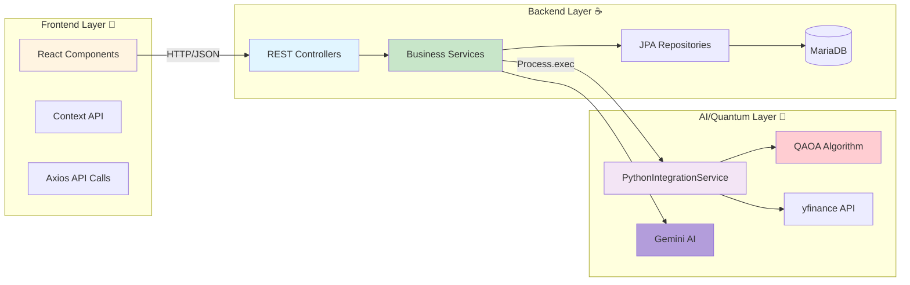
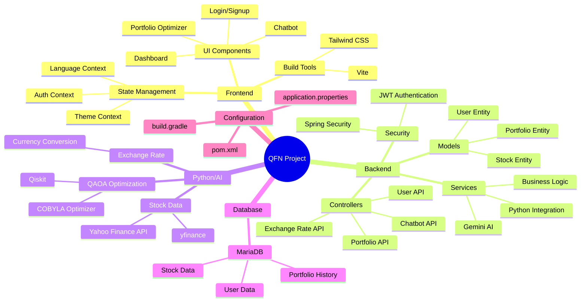
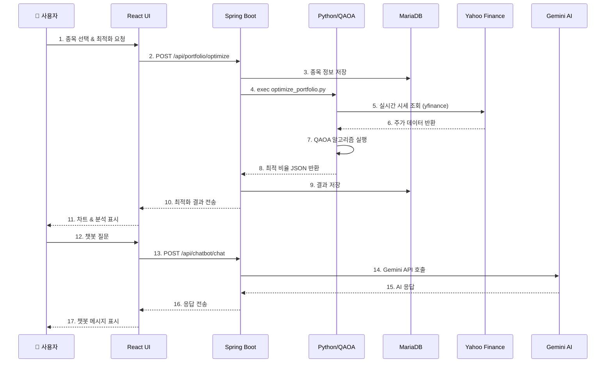
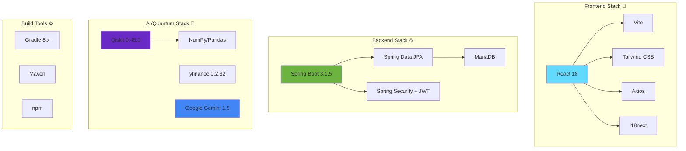
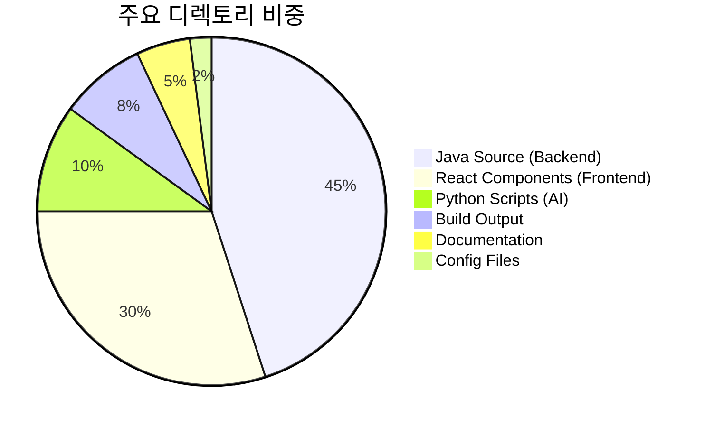

# 📁 QFN 프로젝트 파일 구조

## 전체 구조 다이어그램

```mermaid
graph TD
    ROOT[stock-portfolio-optimizer 📦]
    
    ROOT --> FRONTEND[frontend/ 🎨]
    ROOT --> BACKEND[src/ ☕]
    ROOT --> BUILD[build/ 🔨]
    ROOT --> GRADLE[gradle/ ⚙️]
    ROOT --> DOCS[docs/ 📚]
    ROOT --> CONFIG[설정 파일]
    
    %% Frontend
    FRONTEND --> FRONTEND_SRC[src/]
    FRONTEND --> FRONTEND_PUBLIC[public/]
    FRONTEND --> FRONTEND_CONFIG[설정 파일]
    
    FRONTEND_SRC --> COMPONENTS[components/]
    FRONTEND_SRC --> CONTEXTS[contexts/]
    FRONTEND_SRC --> UTILS[utils/]
    FRONTEND_SRC --> APP[App.jsx]
    
    COMPONENTS --> LOGIN[Login.jsx]
    COMPONENTS --> SIGNUP[Signup.jsx]
    COMPONENTS --> DASHBOARD[Dashboard.jsx]
    COMPONENTS --> PORTFOLIO[PortfolioOptimizer.jsx]
    COMPONENTS --> CHATBOT[Chatbot.jsx]
    COMPONENTS --> HEADER[Header.jsx]
    COMPONENTS --> SIDEBAR[Sidebar.jsx]
    
    CONTEXTS --> AUTH[AuthContext.jsx]
    CONTEXTS --> THEME[ThemeContext.jsx]
    CONTEXTS --> LANG[LanguageContext.jsx]
    
    UTILS --> I18N[i18n.js]
    
    %% Backend
    BACKEND --> JAVA[java/]
    BACKEND --> PYTHON[python/]
    BACKEND --> RESOURCES[resources/]
    
    JAVA --> PORTFOLIO_PKG[com/portfolio/optimizer/]
    
    PORTFOLIO_PKG --> CONTROLLER[controller/]
    PORTFOLIO_PKG --> SERVICE[service/]
    PORTFOLIO_PKG --> MODEL[model/]
    PORTFOLIO_PKG --> REPOSITORY[repository/]
    PORTFOLIO_PKG --> CONFIG_PKG[config/]
    PORTFOLIO_PKG --> SECURITY[security/]
    
    CONTROLLER --> USER_CTRL[UserController]
    CONTROLLER --> PORT_CTRL[PortfolioController]
    CONTROLLER --> CHAT_CTRL[ChatbotController]
    CONTROLLER --> EXCHANGE_CTRL[ExchangeRateController]
    
    SERVICE --> USER_SVC[UserService]
    SERVICE --> PORT_SVC[PortfolioService]
    SERVICE --> CHAT_SVC[ChatbotService]
    SERVICE --> GEMINI_SVC[GeminiService]
    SERVICE --> PYTHON_SVC[PythonIntegrationService]
    
    MODEL --> USER_MODEL[User]
    MODEL --> PORT_MODEL[Portfolio]
    MODEL --> STOCK_MODEL[Stock]
    MODEL --> OPT_MODEL[OptimizationResult]
    
    PYTHON --> OPT_PY[optimize_portfolio.py]
    PYTHON --> FETCH_PY[fetch_stock_data.py]
    PYTHON --> EXCHANGE_PY[exchange_rate_config.py]
    PYTHON --> REQ[requirements.txt]
    
    RESOURCES --> APP_PROP[application.properties]
    RESOURCES --> STATIC[static/]
    
    %% Config Files
    CONFIG --> POM[pom.xml]
    CONFIG --> GRADLE_BUILD[build.gradle]
    CONFIG --> APP_PROP_ROOT[application.properties]
    CONFIG --> README_FILE[README.md]
    
    %% Docs
    DOCS --> PRESENTATION[presentation-outline.md]
    
    style ROOT fill:#e1f5ff
    style FRONTEND fill:#fff4e1
    style BACKEND fill:#e8f5e9
    style PYTHON fill:#f3e5f5
    style COMPONENTS fill:#ffe0b2
    style SERVICE fill:#c8e6c9
    style CONTROLLER fill:#b2dfdb
```

## 상세 계층 구조

## 주요 파일별 역할

## 핵심 데이터 흐름

## 기술 스택 맵

## 파일 크기 분석

---

## 📊 통계 요약

| 항목 | 수량 |
|------|------|
| **총 Java 클래스** | ~40개 |
| **React 컴포넌트** | 13개 |
| **Python 스크립트** | 5개 |
| **REST API 엔드포인트** | ~20개 |
| **데이터베이스 테이블** | 4개 (User, Portfolio, Stock, OptimizationResult) |
| **외부 API 연동** | 2개 (Yahoo Finance, Gemini AI) |

---

**생성 날짜**: 2025-11-10  
**프로젝트 이름**: QuantaFolio Navigator (QFN)  
**버전**: 1.0.0
