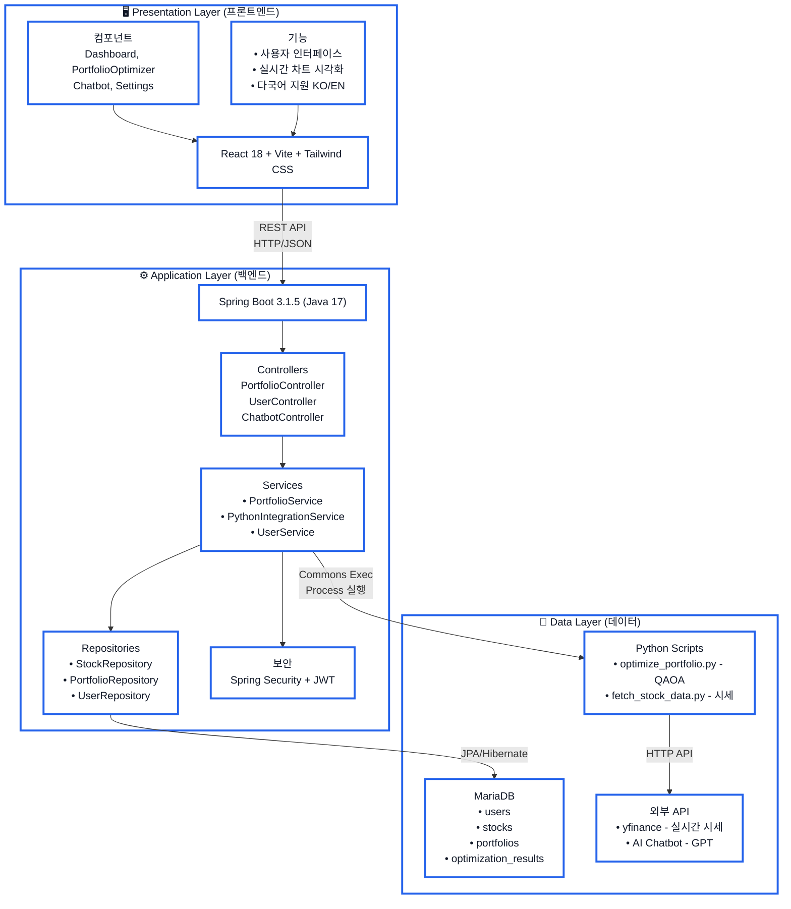

# QuantaFolio Navigator 시스템 아키텍처

## 📐 아키텍처 다이어그램



---

## 📝 계층별 상세 설명

### 🖥️ Presentation Layer (프론트엔드)

**역할:** 사용자 인터페이스 제공 및 데이터 시각화

**기술 스택:**
- **React 18**: 컴포넌트 기반 UI 라이브러리, 상태 관리
- **Vite**: 빠른 빌드 도구 (Webpack 대비 10배 빠른 HMR)
- **Tailwind CSS**: 유틸리티 클래스 기반 스타일링

**주요 컴포넌트:**
- `Dashboard`: 포트폴리오 요약 및 성과 지표 차트
- `PortfolioOptimizer`: 종목 검색, 위험도 설정, 최적화 실행
- `Chatbot`: AI 기반 투자 질의응답
- `Settings`: 언어 변경, 테마 설정

**핵심 기능:**
- 사용자 입력 처리 (종목 검색, 수량/위험도 설정)
- REST API 호출 (Axios HTTP 클라이언트)
- 차트 시각화 (Recharts: 라인/파이/바 차트)
- 다국어 지원 (i18next: 한국어/영어)

**데이터 흐름:**
```
사용자 입력 → React State → Axios HTTP 요청 → Backend API
← JSON 응답 ← Backend API
결과 시각화 → 차트/표 렌더링
```

---

### ⚙️ Application Layer (백엔드)

**역할:** 비즈니스 로직 처리, API 제공, 데이터 연동 조율

**기술 스택:**
- **Java 17**: LTS 버전, 최신 문법 지원 (Records, Pattern Matching)
- **Spring Boot 3.1.5**: 자동 설정, 내장 Tomcat 서버
- **Spring Data JPA**: ORM (Hibernate 6.2.x)
- **Spring Security + JWT**: Stateless 인증/인가

**계층 구조 (MVC 패턴):**

**Controllers (API 라우팅)**
- `PortfolioController`: 포트폴리오 관련 API
  - `GET /api/portfolio/stock-price/{symbol}` - 시세 조회
  - `POST /api/portfolio/optimize` - 최적화 실행
- `UserController`: 회원 관리 API
  - `POST /api/users/login` - 로그인
  - `POST /api/users/signup` - 회원가입
- `ChatbotController`: AI 챗봇 API
  - `POST /api/chatbot/chat` - 대화 처리

**Services (비즈니스 로직)**
- `PortfolioService`: 포트폴리오 CRUD, 최적화 전처리/후처리
- `PythonIntegrationService`: Python 스크립트 실행 및 결과 파싱
- `UserService`: 인증, JWT 토큰 생성/검증, 이메일 발송

**Repositories (데이터 접근)**
- `StockRepository`: 종목 정보 CRUD
- `PortfolioRepository`: 포트폴리오 저장/조회
- `UserRepository`: 사용자 정보 관리

**보안:**
- JWT 토큰 기반 인증 (Stateless, 수평 확장 가능)
- Spring Security 필터 체인 (인증/인가 자동 처리)
- 비밀번호 암호화 (BCrypt)

**데이터 흐름:**
```
HTTP 요청 → Controller (검증)
→ Service (비즈니스 로직)
  → Repository (DB 접근) / PythonIntegrationService (Python 실행)
← DTO 변환
← HTTP 응답 (JSON)
```

---

### 💾 Data Layer (데이터)

**역할:** 데이터 영속화, AI/최적화 처리, 외부 데이터 연동

#### 1. MariaDB (관계형 데이터베이스)

**테이블 구조:**
- `users`: 사용자 정보 (ID, 이메일, 비밀번호, 역할)
- `stocks`: 종목 정보 (심볼, 이름, 가격, 수량)
- `portfolios`: 포트폴리오 (사용자 ID, 생성일)
- `optimization_results`: 최적화 결과 히스토리 (배분비율, 수익률, 위험도)

**연동 방식:**
- JPA/Hibernate ORM (객체-관계 매핑)
- 자동 쿼리 생성 (메서드 이름 규칙)
- 트랜잭션 관리 (@Transactional)

#### 2. Python Scripts (데이터 처리/AI)

**실행 방식:**
- Apache Commons Exec로 Python 프로세스 실행
- JSON 파일 입출력 (Java ↔ Python 통신)
- stdout 캡처로 결과 받아옴

**주요 스크립트:**

**optimize_portfolio.py (QAOA 최적화)**
```python
입력: { "symbols": ["AAPL", "MSFT"], "riskFactor": 5 }
처리: Qiskit QAOA 알고리즘 실행
출력: { "allocation": {...}, "expectedReturn": 0.12, "risk": 0.08 }
```
- Qiskit Optimization 라이브러리 사용
- 목적함수: minimize(risk - risk_factor * return)
- 제약조건: Σ weights = 1

**fetch_stock_data.py (실시간 시세)**
```python
입력: { "symbol": "AAPL" }
처리: yfinance로 실시간 가격 조회, 실패 시 Mock 폴백
출력: { "symbol": "AAPL", "price": 234000, "dataSource": "yfinance" }
```
- USD → KRW 환율 자동 변환 (현재 고정값 1300)
- 통계 데이터 계산 (평균, 표준편차)

#### 3. External APIs (외부 연동)

**yfinance (Yahoo Finance)**
- 실시간 주식 시세 조회
- 과거 데이터 다운로드 (2년치)
- 거래 시간 중 15-20분 지연 데이터

**AI Chatbot API (예: OpenAI GPT)**
- 투자 관련 질문 답변
- 프롬프트 엔지니어링으로 정확도 향상

---

## 🔄 주요 데이터 흐름

### 시나리오 1: 포트폴리오 최적화 실행

```
1. 사용자 (React)
   └─ 종목 입력 (AAPL, MSFT), 위험도 5

2. POST /api/portfolio/optimize
   └─ { "symbols": ["AAPL", "MSFT"], "riskFactor": 5 }

3. PortfolioController
   └─ portfolioService.optimize(request)

4. PortfolioService
   ├─ 입력 검증 (종목 수, 위험도 범위)
   └─ pythonIntegrationService.runOptimization(data)

5. PythonIntegrationService
   ├─ input.json 생성
   ├─ python optimize_portfolio.py --input input.json
   └─ stdout 읽기 → JSON 파싱

6. Python (optimize_portfolio.py)
   ├─ Qiskit QAOA 실행 (5-10초 소요)
   └─ 결과 출력: {"allocation": {"AAPL": 0.6, "MSFT": 0.4}, ...}

7. PortfolioService
   ├─ 결과 DB 저장 (optimization_results 테이블)
   └─ DTO 변환

8. HTTP 200 OK
   └─ {"allocation": {...}, "expectedReturn": 0.12, "risk": 0.08}

9. React
   └─ 차트/표로 시각화 (파이 차트: AAPL 60%, MSFT 40%)
```

### 시나리오 2: 실시간 시세 조회

```
1. GET /api/portfolio/stock-price/AAPL

2. PortfolioService
   ├─ 캐시 확인 (5분 TTL)
   └─ 캐시 없으면 Python 실행

3. Python (fetch_stock_data.py)
   ├─ yfinance.Ticker("AAPL").info
   ├─ 실패 시 Mock 데이터 폴백
   └─ USD → KRW 변환 (180 * 1300 = 234000)

4. HTTP 200 OK
   └─ {"symbol": "AAPL", "price": 234000, "dataSource": "yfinance"}

5. React
   └─ "AAPL - ₩234,000" 표시
```

---

## 🎯 아키텍처 설계 원칙 및 장점

### 설계 원칙

1. **관심사의 분리 (Separation of Concerns)**
   - 각 계층은 자신의 역할에만 집중
   - Presentation: UI/UX, Application: 로직, Data: 저장/처리

2. **느슨한 결합 (Loose Coupling)**
   - 인터페이스를 통한 통신 (REST API, JPA Repository)
   - 구현 변경 시 다른 계층 영향 최소화

3. **높은 응집도 (High Cohesion)**
   - 관련 기능을 하나의 모듈에 집중
   - Controller: 라우팅만, Service: 비즈니스만

### 핵심 장점

1. **유지보수 용이**
   - Frontend 수정 시 Backend 영향 없음
   - Python 알고리즘 변경 시 Java 코드 수정 불필요

2. **기술 스택 최적 활용**
   - React: 빠른 UI 개발, 컴포넌트 재사용
   - Java/Spring: 안정성, 엔터프라이즈급 기능
   - Python: 데이터 과학 생태계 (Qiskit, yfinance)

3. **확장 가능**
   - 새로운 최적화 알고리즘 → Python 스크립트만 추가
   - 새로운 데이터 소스 → Service 레이어만 수정
   - 수평 확장 → JWT Stateless 인증, REST API

4. **테스트 용이**
   - 각 계층 단위 테스트 가능
   - Mock 객체로 의존성 격리

---

**작성일:** 2025.11.10  
**프로젝트:** QuantaFolio Navigator  
**팀:** KDH-0309
